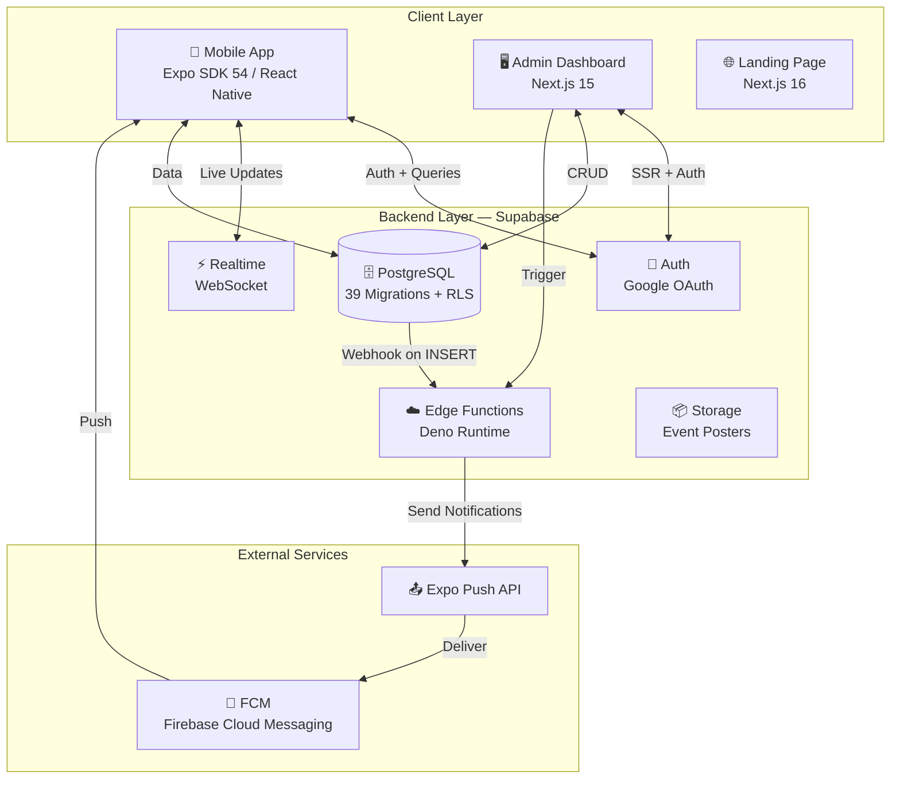
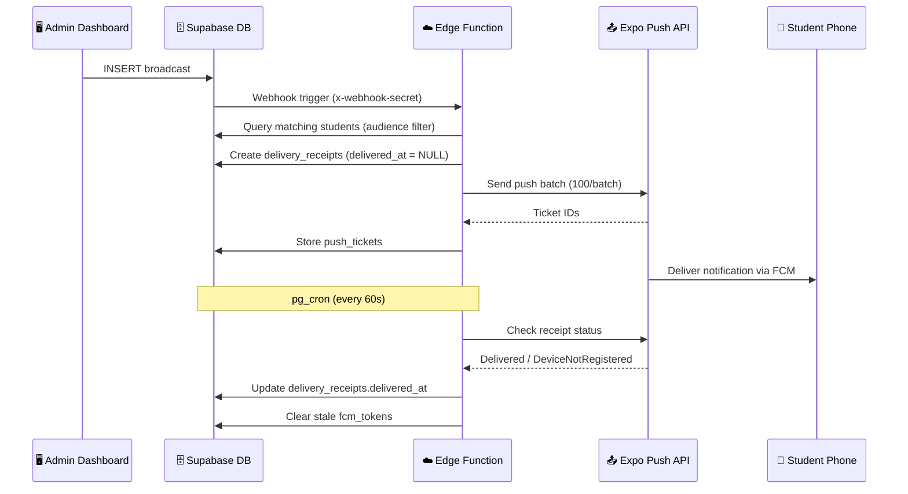
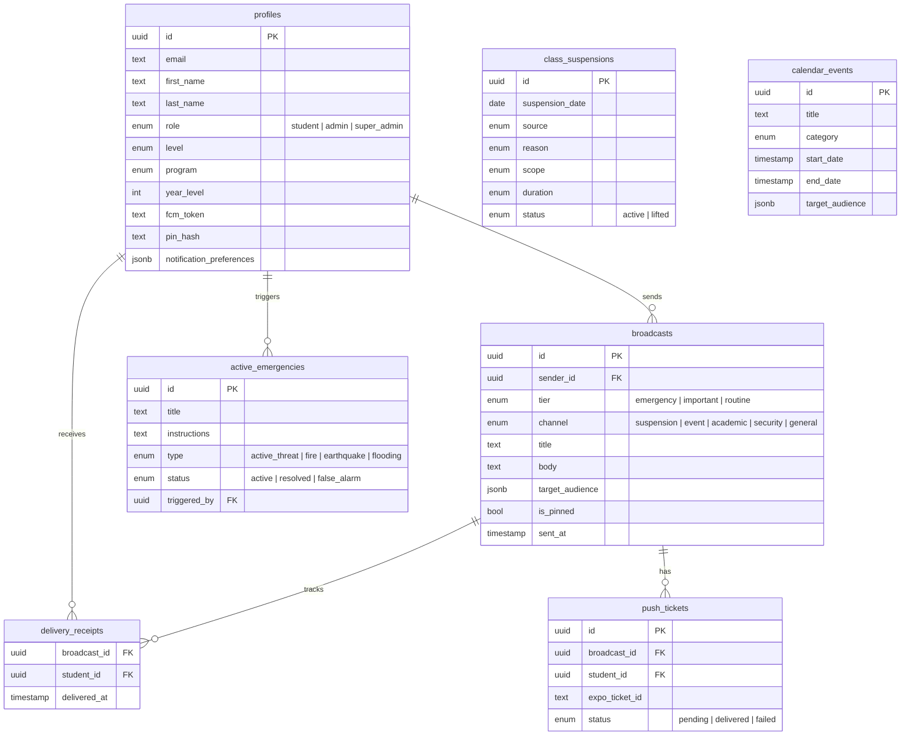

<h1 align="center">
  <br>
  
  <br>
  CampusCurrents
  <br>
</h1>

<p align="center">
  <strong>Real-time campus communication for SSC-R Manila</strong>
</p>

<p align="center">
  Instant class suspension alerts · Emergency notifications · School event updates · Targeted announcements
</p>

<p align="center">
  <a href="https://github.com/kxnn02/campus-currents/releases/tag/v1.0.0-beta.1">
    
  </a>
</p>

---

## Overview

CampusCurrents is a full-stack campus communication system built for San Sebastian College – Recoletos, Manila. It delivers real-time alerts, class suspension updates, and emergency notifications to students through a mobile app, managed by an admin web dashboard.

**Built as a Software Engineering project** by BSIT students with production-grade architecture.

## System Architecture



## Push Notification Flow



## Emergency Response Flow

```mermaid
stateDiagram-v2
    [*] --> Idle: No active emergency
    Idle --> PINValidation: Admin triggers emergency
    PINValidation --> Countdown: PIN verified (bcrypt)
    Countdown --> Active: 5-second countdown complete
    Active --> Monitoring: Students receive full-screen overlay
    Monitoring --> Monitoring: Real-time accountability updates
    Note right of Monitoring: Dashboard shows:<br/>✅ Safe | 🆘 Need Help<br/>⏳ No Response | 📵 Not Reached
    Monitoring --> Resolved: Admin marks "All Clear"
    Monitoring --> FalseAlarm: Admin marks "False Alarm"
    Resolved --> [*]
    FalseAlarm --> [*]
```

## Tech Stack

| Layer | Technology | Version |
|-------|-----------|---------|
| Mobile App | React Native (Expo) | SDK 54 |
| Mobile Router | expo-router | v6 |
| Admin Dashboard | Next.js | 15.5 |
| Landing Page | Next.js | 16.2 |
| Language | TypeScript | 5.9 |
| Database | PostgreSQL (Supabase) | — |
| Auth | Supabase Auth + Google OAuth | — |
| Realtime | Supabase Realtime (WebSocket) | — |
| Edge Functions | Deno (Supabase Functions) | — |
| Push Notifications | Expo Push API → FCM | — |
| State Management | TanStack React Query | v5 |
| Styling (Mobile) | React Native StyleSheet | — |
| Styling (Web) | Tailwind CSS | v4 |
| UI Components | shadcn/ui | — |
| Testing | Vitest + fast-check | — |
| Build | EAS Build | — |

## Repository Structure

```
campus-currents/
├── campus-currents-app/           # 📱 Mobile app
│   ├── app/                       #    File-based routing (expo-router)
│   │   ├── (auth)/                #    Login flow
│   │   ├── (tabs)/                #    Feed, Status, Calendar, Profile
│   │   ├── emergency-overlay.tsx  #    Full-screen emergency alert
│   │   └── broadcast-detail.tsx   #    Announcement detail view
│   ├── components/                #    Reusable UI (BroadcastCard, StatusIndicator, etc.)
│   ├── lib/                       #    Business logic (feed, suspensions, notifications)
│   ├── constants/                 #    Design tokens (Theme.ts)
│   ├── __tests__/                 #    Unit + property-based tests
│   └── app.json                   #    Expo configuration
│
├── admin-dashboard/               # 🖥️ Admin web app
│   └── src/
│       ├── app/dashboard/         #    Broadcasts, Suspensions, Emergency, Calendar, Analytics
│       ├── components/            #    Dashboard UI components
│       └── lib/                   #    Supabase client, utilities
│
├── campus-currents-website/       # 🌐 Landing page
│   ├── app/                       #    Next.js app router
│   └── components/                #    Hero, Features, InteractivePhone, Team, etc.
│
├── supabase/                      # 🗄️ Backend
│   ├── migrations/                #    39 SQL migration files
│   └── functions/                 #    Edge Functions (push, check-push-receipts)
│
├── TEAM-GUIDE.md                  # 📖 Complete team onboarding guide
└── README.md                      # ← You are here
```

## Features

### Student Mobile App

| Feature | Description |
|---------|-------------|
| **Notification Feed** | Tier-based announcements (Emergency/Important/Routine) with filter chips, pinned posts, infinite scroll |
| **Class Suspension Hub** | Three-state indicator (ON/SUSPENDED/MONITORING) with scope-aware filtering by student level |
| **School Calendar** | Interactive month grid with events, suspensions, and announcements per date |
| **Emergency Overlay** | Full-screen red alert with I'm Safe / Need Help — persists across app relaunch |
| **Push Notifications** | Tiered Android channels — emergency overrides silent mode |
| **Notification Preferences** | Per-channel mute for routine alerts, enforced server-side at delivery |
| **Realtime Updates** | WebSocket live feed with exponential backoff reconnection |
| **Offline Resilience** | Stale data banners, connectivity sync, receipt queue |

### Admin Dashboard

| Feature | Description |
|---------|-------------|
| **Broadcast Management** | Create/edit/delete with audience targeting + send confirmation |
| **Suspension Management** | Template-based entry with auto-generated human-readable messages |
| **Emergency System** | PIN-validated trigger, real-time accountability dashboard, "Need Help" contact list |
| **Calendar Events** | CRUD with poster upload and audience targeting |
| **Analytics** | Verified delivery stats per broadcast (Expo receipt confirmation) |
| **Student Directory** | Search and filter all registered students |

### Backend & Security

| Feature | Description |
|---------|-------------|
| **Two-Phase Push Delivery** | Send → store tickets → verify receipts → confirm delivery |
| **Stale Token Cleanup** | Auto-clear `fcm_token` on `DeviceNotRegistered` |
| **Row Level Security** | 39 RLS policies — students read-only, admins write |
| **Webhook Secret** | Push function validates `X-Webhook-Secret` header |
| **Duplicate Emergency Prevention** | DB trigger rejects new emergency while one is active |
| **Auto-Level Derivation** | DB trigger sets `level` from `program` on insert/update |

## Getting Started

### Prerequisites

- Node.js 18+
- Git
- Android phone (for testing push notifications)

### Mobile App

```bash
cd campus-currents-app
npm install
cp .env.example .env    # Fill in Supabase credentials
npx expo start --dev-client
```

### Admin Dashboard

```bash
cd admin-dashboard
npm install
cp .env.local.example .env.local    # Fill in Supabase credentials
npm run dev
```

### Landing Page

```bash
cd campus-currents-website
npm install
npm run dev
```

### Running Tests

```bash
cd campus-currents-app
npm test
```

Tests cover: audience targeting, notification routing, time formatting, suspension scope matching, and level derivation — including property-based tests with fast-check.

## Database Schema



## Edge Functions

| Function | Trigger | Purpose |
|----------|---------|---------|
| `push` | DB webhook (broadcasts INSERT) | Audience-filtered push notification delivery via Expo API |
| `check-push-receipts` | pg_cron (every 60s) | Verifies delivery via Expo Receipts API, cleans stale tokens |

## Team

| Name | Role |
|------|------|
| Kenneth Clein Fernandez | Project Manager & Lead Developer |
| Chi Leyco | Backend Developer & QA |
| Marvin Miranda | UI/UX Designer & QA |
| Andrei Baguisa | Documentation & QA |
| Jheniel Maglinte | Documentation & QA |

**San Sebastian College – Recoletos, Manila** · BSIT · Software Engineering · 2026

## License

This project is developed for academic purposes as a Software Engineering project. All rights reserved.
